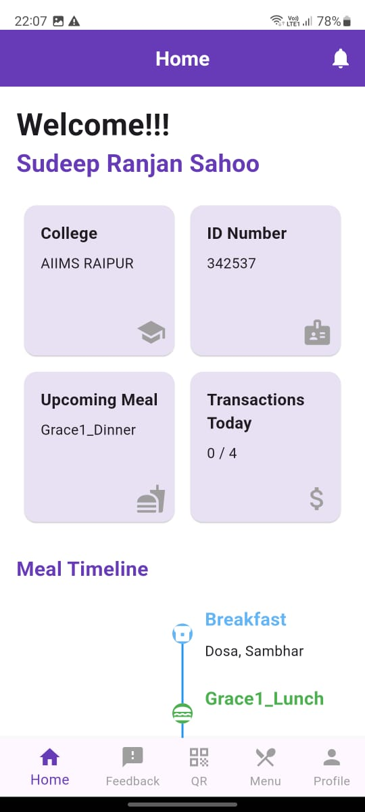
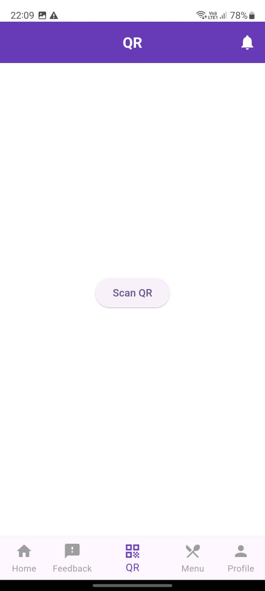
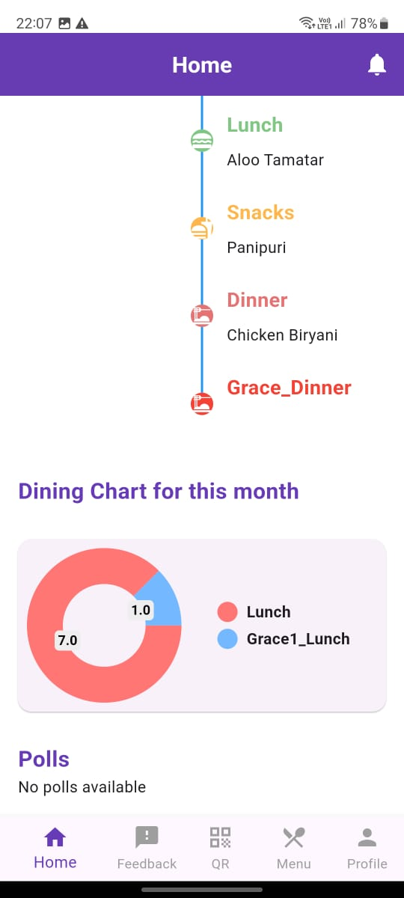
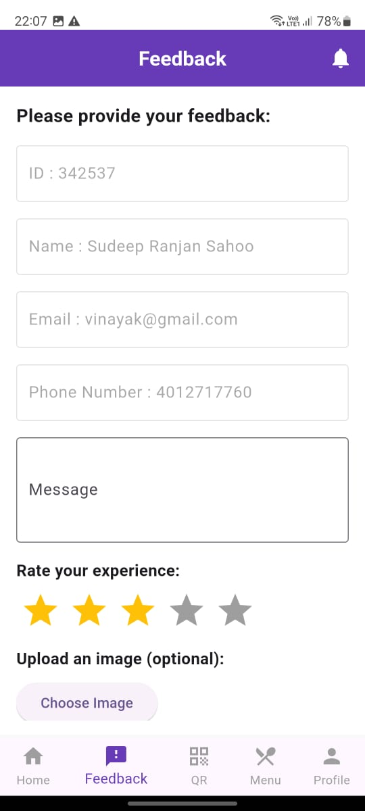
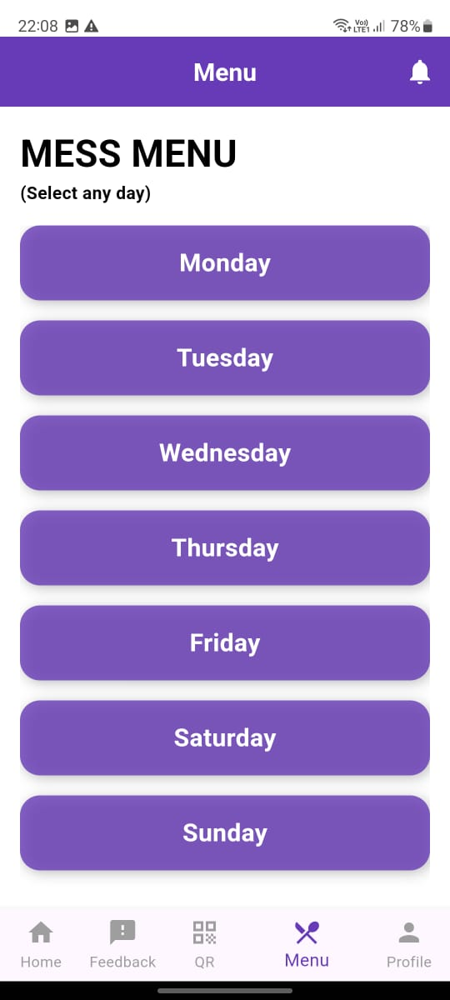
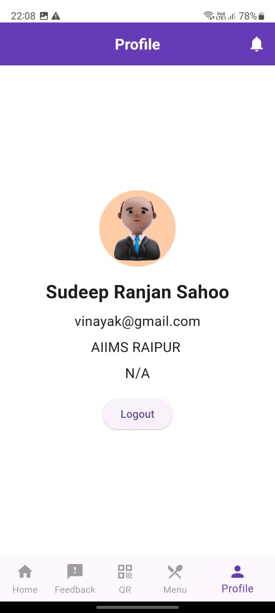

# Digital Mess Application

A digital solution for managing mess transactions with QR code scanning. Currently used by over 1000 students and extending to other colleges.

## Purpose

This application simplifies the management of mess transactions for students and administration. With QR code scanning capabilities, it ensures quick and accurate transaction processing.

## Tech Stack

- **Frontend:** Flutter
- **Backend:** Node.js, hosted on AWS
<!-- - **Database:** MongoDB (or mention the database you used if different) -->

## Features

- **QR Code Scanning:** Fast and reliable QR code scanning for mess transactions.
- **Home Page:** Displays a timeline of upcoming meals and the number of meals consumed.
- **Polls:** Participate in various polls.
- **Notifications:** Stay updated with important notifications.
- **Menu Section:** View the weekly menu day-wise.
- **Feedback Section:** Provide feedback easily.
- **User Profiles:** View and edit your profile.

## Screenshots

| Login Page                          | Home Page                          | QR Code Scanner                     | Dining Chart Section                 | Feedback Page                 | Menu Screen                 | Profile Section                 |
|---------------------------------------|---------------------------------------|-------------------------------------|--------------------------------------|--------------------------------------|--------------------------------------|--------------------------------------|
|  |  |  |  |  |  |  |

## Getting Started

This application is available on the Google Play Store. You can download it [here](https://play.google.com/store/apps/details?id=com.ssshospitality.mess_app&pcampaignid=web_share).

## License

This project is licensed under the MIT License - see the [LICENSE](LICENSE) file for details.
